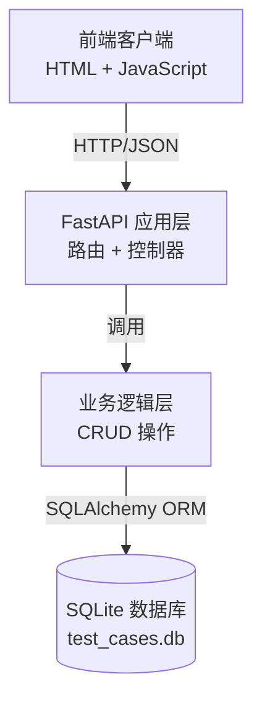
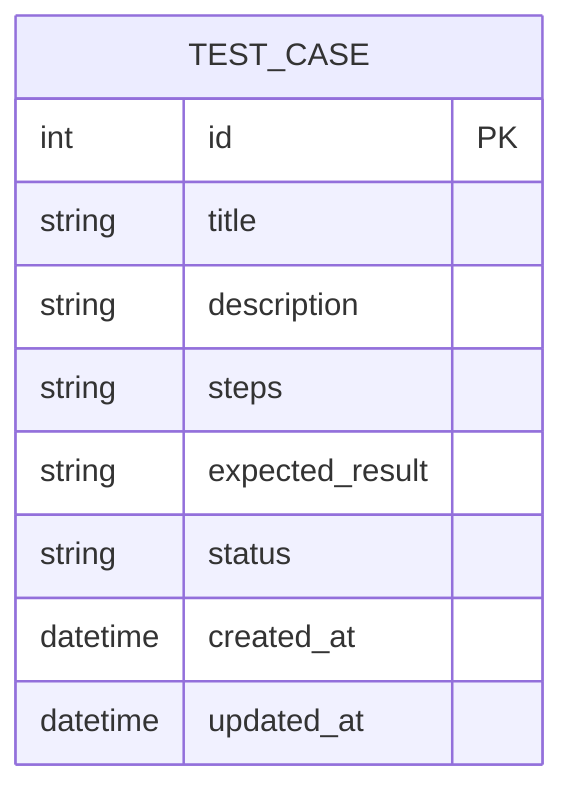
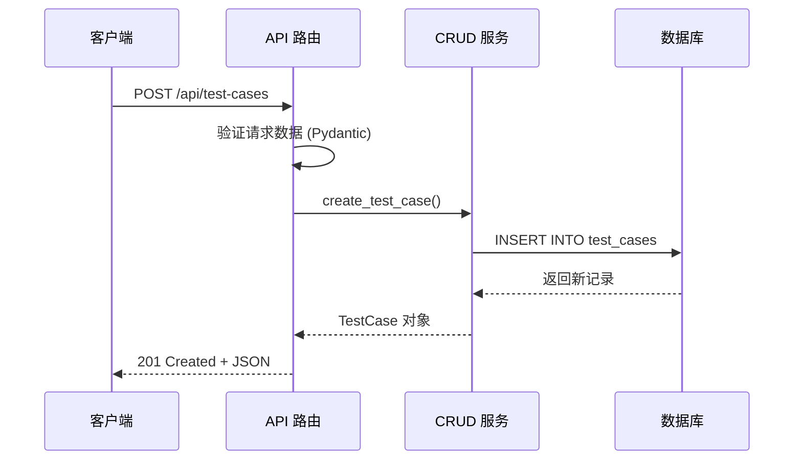

# 设计文档

## 概述

测试用例管理平台是一个基于 FastAPI 的轻量级 Web 应用，采用简单的三层架构设计。系统使用 SQLite 作为数据库（无需额外安装），SQLAlchemy 作为 ORM 框架，Pydantic 进行数据验证。前端提供一个简单的 HTML + JavaScript 页面用于演示和学习。

### 技术栈

- **后端框架**: FastAPI 0.104+
- **数据库**: SQLite 3
- **ORM**: SQLAlchemy 2.0+
- **数据验证**: Pydantic 2.0+
- **CORS 中间件**: FastAPI 内置
- **前端**: 原生 HTML + JavaScript (Fetch API)

### 设计原则

1. **简单优先**: 使用最简单的技术栈，避免过度设计
2. **学习友好**: 代码结构清晰，注释详细，易于理解
3. **快速启动**: 最小化依赖，一条命令即可运行
4. **渐进式**: 为未来扩展预留空间，但不提前实现

## 架构设计

### 系统架构图



### 目录结构

```
test-case-platform/
├── app/
│   ├── __init__.py
│   ├── main.py              # FastAPI 应用入口
│   ├── models.py            # SQLAlchemy 数据模型
│   ├── schemas.py           # Pydantic 数据模式
│   ├── database.py          # 数据库连接配置
│   └── crud.py              # CRUD 操作函数
├── static/
│   └── index.html           # 前端示例页面
├── requirements.txt         # Python 依赖
├── README.md               # 项目说明文档
└── test_cases.db           # SQLite 数据库文件（运行时生成）
```

## 组件和接口

### 1. 数据库层 (database.py)

**职责**: 管理数据库连接和会话

**关键组件**:
- `SQLALCHEMY_DATABASE_URL`: SQLite 数据库连接字符串
- `engine`: SQLAlchemy 引擎实例
- `SessionLocal`: 数据库会话工厂
- `Base`: 声明式基类
- `get_db()`: 依赖注入函数，提供数据库会话

**设计决策**: 使用 SQLite 避免额外的数据库安装，适合学习和开发环境

### 2. 数据模型层 (models.py)

**职责**: 定义数据库表结构

**TestCase 模型**:
```python
class TestCase(Base):
    __tablename__ = "test_cases"
    
    id: int                    # 主键，自增
    title: str                 # 标题，必填，最大 200 字符
    description: str           # 描述，可选，文本类型
    steps: str                 # 测试步骤，可选，文本类型
    expected_result: str       # 预期结果，可选，文本类型
    status: str                # 状态，默认 "active"
    created_at: datetime       # 创建时间，自动生成
    updated_at: datetime       # 更新时间，自动更新
```

**字段说明**:
- `id`: 整数主键，数据库自动递增
- `title`: 测试用例标题，必填字段
- `description`: 详细描述，可以为空
- `steps`: 测试步骤，支持多行文本
- `expected_result`: 预期结果描述
- `status`: 状态标识（active/inactive），默认 active
- `created_at`: 记录创建时间戳
- `updated_at`: 记录最后修改时间戳

### 3. 数据模式层 (schemas.py)

**职责**: 定义 API 请求和响应的数据结构，提供数据验证

**TestCaseBase** (基础模式):
- `title`: str, 必填, 1-200 字符
- `description`: Optional[str], 可选
- `steps`: Optional[str], 可选
- `expected_result`: Optional[str], 可选
- `status`: str, 默认 "active"

**TestCaseCreate** (创建请求):
- 继承 TestCaseBase
- 用于 POST 请求

**TestCaseUpdate** (更新请求):
- 所有字段可选
- 用于 PUT 请求

**TestCaseResponse** (响应):
- 继承 TestCaseBase
- 额外包含: id, created_at, updated_at
- 用于所有响应

**设计决策**: 使用 Pydantic 自动进行数据验证和序列化，减少手动验证代码

### 4. CRUD 操作层 (crud.py)

**职责**: 封装所有数据库操作逻辑

**函数列表**:

1. `create_test_case(db, test_case_data)` → TestCase
   - 创建新测试用例
   - 自动设置创建时间和更新时间
   
2. `get_test_cases(db, skip=0, limit=100)` → List[TestCase]
   - 获取测试用例列表
   - 支持分页（默认最多 100 条）
   - 按创建时间降序排序
   
3. `get_test_case(db, test_case_id)` → TestCase | None
   - 根据 ID 获取单个测试用例
   - 不存在返回 None
   
4. `update_test_case(db, test_case_id, test_case_data)` → TestCase | None
   - 更新测试用例
   - 自动更新 updated_at 时间戳
   - 不存在返回 None
   
5. `delete_test_case(db, test_case_id)` → bool
   - 删除测试用例
   - 成功返回 True，不存在返回 False

**设计决策**: 将数据库操作与路由处理分离，提高代码可测试性和可维护性

### 5. API 路由层 (main.py)

**职责**: 定义 HTTP 端点，处理请求和响应

**API 端点**:

| 方法 | 路径 | 功能 | 请求体 | 响应码 |
|------|------|------|--------|--------|
| POST | /api/test-cases | 创建测试用例 | TestCaseCreate | 201 |
| GET | /api/test-cases | 获取测试用例列表 | - | 200 |
| GET | /api/test-cases/{id} | 获取单个测试用例 | - | 200/404 |
| PUT | /api/test-cases/{id} | 更新测试用例 | TestCaseUpdate | 200/404 |
| DELETE | /api/test-cases/{id} | 删除测试用例 | - | 204/404 |
| GET | /docs | Swagger UI 文档 | - | 200 |
| GET | /redoc | ReDoc 文档 | - | 200 |
| GET | / | 前端示例页面 | - | 200 |

**中间件配置**:
- CORS 中间件: 允许所有源访问（开发环境）
- 静态文件服务: 挂载 /static 目录

**设计决策**: 使用 RESTful 风格的 URL 设计，符合行业标准

### 6. 前端示例 (static/index.html)

**职责**: 提供可视化界面演示 API 调用

**功能模块**:
1. 创建测试用例表单
2. 测试用例列表展示
3. 编辑测试用例功能
4. 删除测试用例功能

**技术实现**:
- 使用 Fetch API 进行 HTTP 请求
- 原生 JavaScript 操作 DOM
- 简单的 CSS 样式
- 无需构建工具，直接在浏览器运行

**设计决策**: 使用原生技术避免引入复杂的前端框架，降低学习门槛

## 数据模型

### 测试用例实体关系图



### 数据流图



## 错误处理

### 错误类型和响应

1. **验证错误 (422 Unprocessable Entity)**
   - 触发条件: 请求数据不符合 Pydantic 模式
   - 响应示例:
   ```json
   {
     "detail": [
       {
         "loc": ["body", "title"],
         "msg": "field required",
         "type": "value_error.missing"
       }
     ]
   }
   ```

2. **资源不存在 (404 Not Found)**
   - 触发条件: 请求的测试用例 ID 不存在
   - 响应示例:
   ```json
   {
     "detail": "Test case not found"
   }
   ```

3. **服务器错误 (500 Internal Server Error)**
   - 触发条件: 数据库连接失败或其他未预期错误
   - FastAPI 自动处理并返回错误详情

### 错误处理策略

- 使用 FastAPI 的 `HTTPException` 抛出标准 HTTP 错误
- Pydantic 自动处理数据验证错误
- 数据库会话使用上下文管理器确保正确关闭
- 前端使用 try-catch 捕获网络错误并显示友好提示

## 测试策略

### 测试方法

1. **手动测试**（推荐新手）:
   - 使用 Swagger UI (/docs) 测试所有 API 端点
   - 使用前端页面测试完整流程
   - 使用浏览器开发者工具查看网络请求

2. **API 测试工具**:
   - 使用 Postman 或 curl 测试 API
   - 验证各种边界情况和错误场景

3. **自动化测试**（可选）:
   - 使用 pytest 编写单元测试
   - 测试 CRUD 函数的各种场景
   - 测试 API 端点的请求和响应

### 测试场景

**创建测试用例**:
- ✓ 成功创建（所有字段）
- ✓ 成功创建（仅必填字段）
- ✗ 缺少标题字段
- ✗ 标题超过 200 字符

**获取测试用例列表**:
- ✓ 空列表
- ✓ 包含多个测试用例
- ✓ 验证排序顺序

**获取单个测试用例**:
- ✓ 存在的测试用例
- ✗ 不存在的 ID

**更新测试用例**:
- ✓ 更新所有字段
- ✓ 更新部分字段
- ✗ 不存在的 ID
- ✗ 无效的字段值

**删除测试用例**:
- ✓ 删除存在的测试用例
- ✗ 删除不存在的 ID

## 部署和运行

### 开发环境启动步骤

1. 安装依赖:
   ```bash
   pip install -r requirements.txt
   ```

2. 启动服务:
   ```bash
   uvicorn app.main:app --reload --host 0.0.0.0 --port 8000
   ```

3. 访问应用:
   - API 文档: http://localhost:8000/docs
   - 前端页面: http://localhost:8000
   - ReDoc 文档: http://localhost:8000/redoc

### 配置说明

- 数据库文件: 自动在项目根目录创建 `test_cases.db`
- 端口: 默认 8000，可通过 --port 参数修改
- 热重载: --reload 参数启用，代码修改自动重启

### 环境要求

- Python 3.8+
- pip 包管理器
- 现代浏览器（Chrome, Firefox, Safari, Edge）

## 安全考虑

### 当前实现

- 输入验证: Pydantic 自动验证所有输入
- SQL 注入防护: SQLAlchemy ORM 自动参数化查询
- CORS: 开发环境允许所有源

### 生产环境建议（超出 MVP 范围）

- 添加身份认证和授权
- 限制 CORS 允许的源
- 添加请求速率限制
- 使用 HTTPS
- 添加日志记录
- 使用生产级数据库（PostgreSQL, MySQL）

## 扩展性考虑

### 当前架构支持的扩展

1. **添加新字段**: 在 models.py 和 schemas.py 中添加
2. **添加新端点**: 在 main.py 中添加新路由
3. **添加业务逻辑**: 在 crud.py 中添加新函数
4. **更换数据库**: 修改 database.py 中的连接字符串

### 未来可能的扩展方向

- 用户认证和权限管理
- 测试用例分类和标签
- 测试执行记录
- 文件附件上传
- 搜索和过滤功能
- 导出测试报告
- 团队协作功能

## 学习路径建议

### 第一阶段: 理解基础
1. 阅读 database.py 和 models.py，理解数据库连接和模型定义
2. 阅读 schemas.py，理解数据验证
3. 阅读 crud.py，理解数据库操作

### 第二阶段: API 开发
1. 阅读 main.py，理解路由定义
2. 使用 Swagger UI 测试每个 API
3. 观察请求和响应的数据格式

### 第三阶段: 前后端联调
1. 阅读 index.html，理解前端如何调用 API
2. 使用浏览器开发者工具观察网络请求
3. 尝试修改前端代码，添加新功能

### 第四阶段: 扩展实践
1. 添加新字段（如优先级、负责人）
2. 添加搜索功能
3. 改进前端界面
